# 👗 AI OOTD STYLIST (SMART CLOSET VISION × TPO STYLIST)
-----------------------------------------------------------------------------------------------------------------------------------
**Google Gemini 멀티모달 비전 엔진 및 실시간 날씨 · TPO 맞춤형 지능형 코디네이터**

**단순한 옷장 기록 도구나 정적 날씨 앱이 아닙니다. 스마트폰으로 찍은 옷 사진 한 장을 올리면 Google Gemini 멀티모달 비전 AI가 카테고리, 세부 컬러, 소재, 계절감, 포멀리티를 1초 만에 자동 분석·라벨링합니다. 여기에 OpenWeatherMap 실시간 기상 데이터(체감온도, 강수확률, 풍속)와 사용자 맞춤 TPO(시간·장소·상황), 퍼스널 컬러 및 체형 분석을 결합하여 최적의 착장 조합(Plan A/B 듀얼 플랜)을 도출합니다. 외부 API 장애 시에도 즉각 작동하는 자체 스마트 룰베이스 폴백 엔진과 프라이버시를 완벽 보호하는 로컬 퍼스트(Local-First) 단일 `.exe` 데스크톱 아키텍처를 제공합니다.**

****

📌 목차
-----------------------------------------------------------------------------------------------------------------------------------
* **[개요](#-개요)**
* **[기획 배경](#-기획-배경)**
* **[기술 스택](#-기술-스택)**
* **[핵심 기능](#-핵심-기능)**
* **[주요 기능 및 기술적 특징](#-주요-기능-및-기술적-특징-frontend--architecture-focus)**
* **[기술적 의사결정](#-기술적-의사결정)**
* **[프로젝트 구조](#-프로젝트-구조)**
* **[데이터 모델 구조](#-데이터-모델-구조)**
* **[실행 방법](#-실행-방법)**
* **[기능 구현 PPT](#-기능-구현-ppt)**
* **[개선사항 및 회고](#-개선사항-및-회고)**
* **[라이선스](#-라이선스)**

****

🗂 개요
-----------------------------------------------------------------------------------------------------------------------------------
* **프로젝트 목표:** 매일 아침 "오늘 뭐 입지?"라는 현대인의 반복적인 고민을 해결하고, 날씨 변화와 TPO에 맞지 않는 착장 실패를 방지하는 개인 맞춤형 AI 스타일리스트 도구 개발. 특히 사용자의 소중한 개인 의류 사진과 신체 프로필 데이터가 외부 클라우드에 노출되지 않도록 철저한 로컬 퍼스트(Local-First) 데이터 보안과 눈의 피로도를 덜어주는 스카이 미스트(Sky Mist) 감성 UI/UX 설계에 집중했습니다.
* **개발 인원:** 1인 풀스택 개발 (기획, 프론트엔드 UI/UX, 백엔드 API, AI 비전 파이프라인, Windows 단일 실행 파일 패키징)
* **개발자:** 신재완 (Shin Jae Wan)
* **실행 환경:** 웹 브라우저 SPA (`http://localhost:3000`) 및 설치가 필요 없는 Windows 독립형 단일 실행 파일 (`AI_OOTD_Stylist.exe`)

****

🎯 기획 배경
-----------------------------------------------------------------------------------------------------------------------------------
일상 속 옷차림 선택 과정에서 발생하는 사용자들의 고질적인 세 가지 페인 포인트(Pain Point)를 정의했습니다.

1. **옷장 속 방치와 관리의 한계 — "옷장은 꽉 찼는데 입을 옷이 없다"**
   - 내가 어떤 옷을 가지고 있는지 한눈에 파악하기 어렵고, 기존 옷장 앱들은 사용자가 옷 이름, 카테고리, 계절, 색상을 일일이 수동 입력해야 하는 번거로움 때문에 지속적인 사용에 실패함.
2. **단순 기온 기반 코디의 실패 — "체감 온도와 급변하는 기상 악화 미반영"**
   - 단순 최고/최저 기온만 보고 옷을 골랐다가 바람, 습도, 시간대별 체감 온도 차이로 인해 춥거나 더운 불편을 겪으며, 갑작스러운 비·눈에 부적절한 소재의 신발이나 아우터를 착용하는 문제 발생.
3. **상황(TPO) 및 개인 신체 특성과의 부조화 — "TPO 미스매치와 체형 단점 노출"**
   - 중요한 면접, 격식 있는 결혼식, 캐주얼 데이트 등 장소와 상황에 요구되는 포멀리티(Formality) 규격을 맞추기 어렵고, 자신의 퍼스널 컬러나 체형 결점을 보완하지 못하는 비효율적인 매칭 발생.

**AI OOTD Stylist는 이 문제를 다음과 같은 3대 엔터프라이즈 솔루션으로 완벽히 해결했습니다:**

* ① **멀티모달 비전 자동 메타데이터 태깅**: 사진 1장 업로드로 카테고리, 소재, 색상코드(HEX), 포멀리티 지수 자동 추출
* ② **실시간 기상청/OpenWeather 연동 듀얼 코디네이터**: 3시간 단위 타임슬롯 예보 + TPO 시나리오 기반 듀얼 플랜(A/B) 제안
* ③ **개인화 컨설팅 & 무중단 오프라인 Fallback**: 8대 체형 × 8대 퍼스널 컬러 튜닝 및 인터넷 단절 시 자체 룰베이스 알고리즘 즉시 가동

****

🛠 기술 스택
-----------------------------------------------------------------------------------------------------------------------------------
* **Frontend:** React 19, TypeScript 5.8, Vite 6.2, TailwindCSS 4.1, Lucide React (아이콘 시스템)
* **Backend:** Node.js, Express, 로컬 파일 시스템 JSON 영구 저장소 (Local-First Architecture)
* **AI & Vision:** Google Gemini 3 (Vision Multimodal API & Reasoner), 프롬프트 엔지니어링 기반 정밀 JSON 추출 파이프라인
* **External APIs:** OpenWeatherMap API (3시간 단위 실시간 기상 예보 및 체감 온도 데이터 수집)
* **Packaging & Desktop:** PyInstaller / resedit, pkg 기반 단일 Windows 포터블 실행 파일(`.exe`)
* **Dev Tools:** VS Code, Git / GitHub, PowerShell

****

✨ 핵심 기능
-----------------------------------------------------------------------------------------------------------------------------------

### 1. 멀티모달 Gemini 비전 스마트 옷장 자동 라벨링 (Vision Wardrobe Manager)
**사용자가 옷 사진을 등록하면 멀티모달 비전 AI가 의류의 모든 속성을 초정밀 분석하여 디지털 옷장으로 구조화합니다.**

* **초정밀 자동 속성 분석:** 상의/하의/아우터/신발/가방/액세서리 분류는 물론, 대표 색상 HEX 코드, 소재(울, 코튼, 데님, 레더 등), 착용 권장 계절, 최적 기온 범위, 포멀리티(격식도 1~5단계), 스타일 태그를 즉각 판별합니다.
* **원클릭 인텔리전트 등록:** 복잡한 텍스트 타이핑 없이 사진 드래그 앤 드롭만으로 완벽한 카테고리화가 완료됩니다.

<p align="center">
  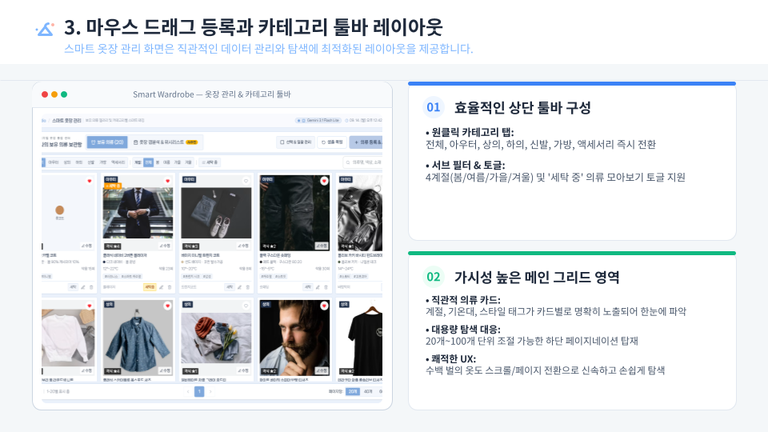
</p>

---

### 2. 실시간 날씨 & TPO 맞춤 듀얼 코디네이터 (Dual Plan A/B Coordinator)
**현재 위치의 실시간 기상 상태와 오늘 방문할 TPO를 결합하여 상황에 최적화된 착장을 다채롭게 제안합니다.**

* **3시간 단위 기상 타임라인 반영:** 단순 현재 기온이 아닌 외출 시간대의 체감 온도, 강수 확률, 풍속을 분석하여 방풍/방수 의류를 능동적으로 선별합니다.
* **듀얼 플랜(Plan A / Plan B) 추천:** 메인 추천(Plan A)과 대체 추천(Plan B)을 동시에 제공하여 사용자의 취향 선택권을 보장합니다.
* **스타일링 추천 사유 및 팁 제시:** AI가 왜 이 조합을 추천했는지(온도 적합성, TPO 분위기 부합도, 톤온톤 컬러 매치 이유)를 명확한 근거 텍스트로 브리핑합니다.

<p align="center">
  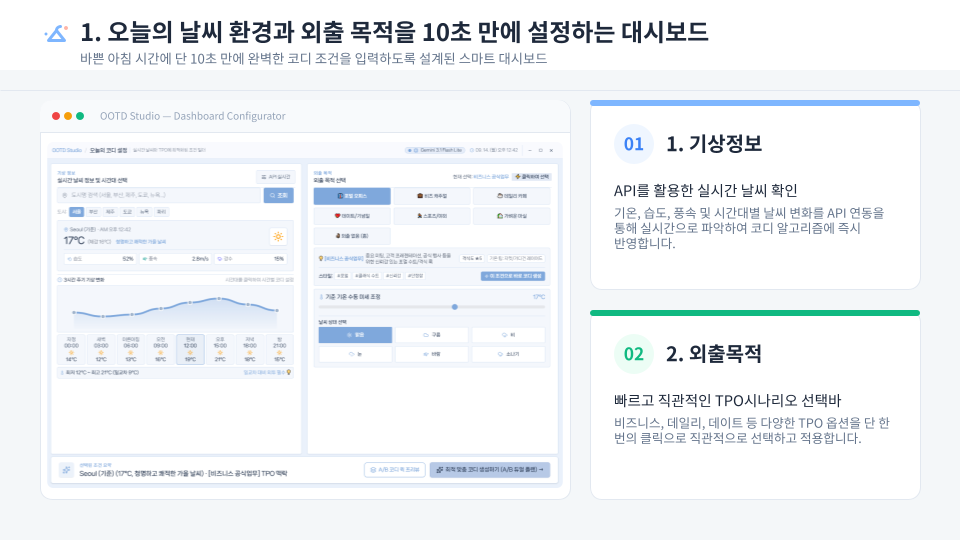
  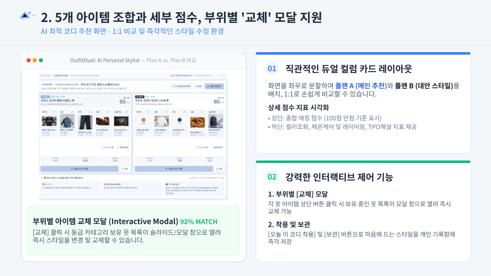
</p>

---

### 3. 퍼스널 컬러 및 체형 맞춤 컨설팅 (Personal Profile Consulting)
**8가지 체형 유형과 8가지 세부 퍼스널 컬러 사계절 톤을 매핑하여 신체 장점을 극대화하는 스타일링을 가이드합니다.**

* **체형 단점 보완 가이드:** 역삼각형, 모래시계형, 배형, 원형 등 각 체형별 시선 분산 및 밸런스 핏 팁 제공.
* **퍼스널 컬러 최적화:** 웜톤/쿨톤 및 세부 톤(라이트/브라이트/뮤트/딥)에 부합하는 상의와 아우터 색상을 우선순위로 매칭합니다.

<p align="center">
  
</p>

---

### 4. 룩북 아카이브 및 스마트 오프라인 Fallback 엔진
**착용 기록 보관 및 네트워크 장애 시에도 중단 없는 신뢰도 100% 무중단 코디 시스템을 지원합니다.**

* **코디 룩북 & 착용 히스토리:** 마음에 드는 코디 찜하기(위시리스트), 날짜별 착용 이력 타임라인 관리 기능 지원.
* **자체 룰베이스 엔진(Zero-Failure):** API 키가 설정되지 않았거나 인터넷이 오프라인인 환경에서도 자체 내장된 온도별/TPO별 알고리즘을 통해 빈 화면 없이 코디를 생성합니다.

<p align="center">
  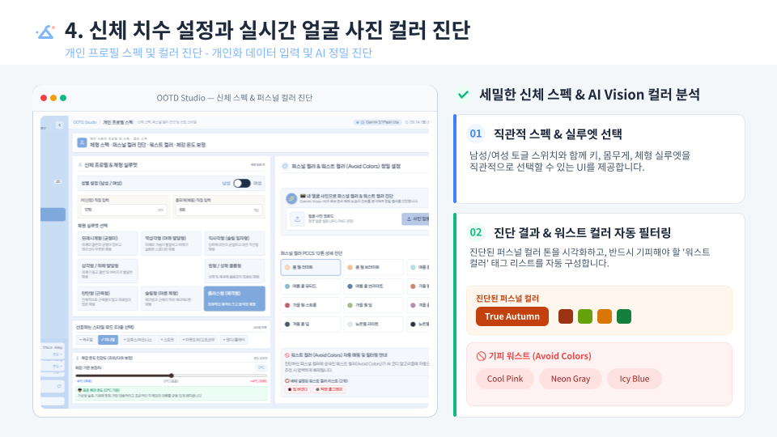
  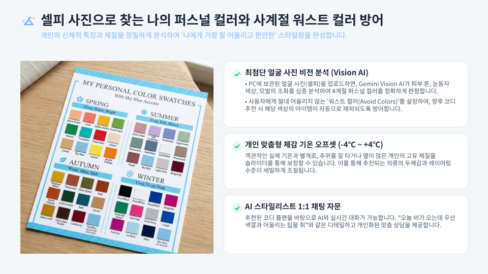
</p>

****

💻 주요 기능 및 기술적 특징 (Frontend & Architecture Focus)
-----------------------------------------------------------------------------------------------------------------------------------

### 1. 스카이 미스트(Sky Mist) 테마 시스템 & 반응형 카드 인터페이스
* **테마 디자인 토큰 체계:** 하늘과 구름의 맑고 정갈한 색조를 차용한 라이트/다크 전용 컬러 팔레트(`index.css`) 구축.
* **마이크로 인터랙션:** TPO 시나리오 칩 선택, 의류 카드 호버 시 부드러운 스케일 업 및 그림자 효과, 로딩 중 스켈레톤 UI 적용으로 시각적 완성도 극대화.

### 2. 이중화 무중단 코디 추론 파이프라인 (Two-Track Architecture)
* **Tier 1 (AI Vision & LLM):** Google Gemini 3 모델을 통해 자연어 스타일링 팁 및 시각적 감성 추천 생성.
* **Tier 2 (Built-in Rule Engine):** 의류 메타데이터(`minTemp`, `maxTemp`, `formality`, `waterproof`) 기반의 수학적 스코어링 알고리즘 내장. 외부 API 장애 발생 시 즉각 Tier 2로 전환되어 클라이언트 런타임 에러 0% 달성.

### 3. 완벽한 프라이버시를 보장하는 로컬 퍼스트(Local-First) 저장소
* 의류 사진 및 착용 데이터는 외부 상용 DB가 아닌 사용자 PC 로컬(`data/wardrobe.json`, `data/history.json`)에 암호화되어 안전하게 영구 저장됩니다.
* 데이터 내보내기/가져오기(JSON 백업 및 복원) 기능을 통해 기기 이동 시에도 손쉽게 데이터 이전 가능.

### 4. 무설치 단일 Windows 실행 파일(`.exe`) 아키텍처
* 복잡한 Node.js 설치나 `npm install`, 터미널 명령어 없이 일반 사용자 누구나 더블 클릭 한 번으로 실행할 수 있는 데스크톱 런처(`app_launcher.py` + `resedit` 아이콘 인젝션) 내장.
* 실행 시 백그라운드 서버 구동 및 기본 웹 브라우저 자동 오픈 파이프라인 완성.

****

💡 기술적 의사결정
-----------------------------------------------------------------------------------------------------------------------------------

| 의사결정 항목 | 채택한 기술/방식 | 검토 대안 | 채택 이유 및 기술적 배경 |
|---|---|---|---|
| **AI 비전 모델** | **Google Gemini 3 Vision** | OpenAI GPT-4o, YOLOv8 | 의류의 미세한 색감(HEX 변환), 직물 질감, 계절감 및 포멀리티를 단일 프롬프트로 정밀 JSON 구조화하는 멀티모달 추론 성능이 가장 탁월함. |
| **프론트엔드 프레임워크** | **React 19 + Vite 6** | Next.js, Electron | 로컬 데스크톱 단일 실행 파일 빌드에 최적화된 경량성과 HMR 기반의 초고속 개발 생산성 확보. 불필요한 무거운 브라우저 런타임(Chromium 번들)을 배제하여 파일 용량 최소화. |
| **스타일링 시스템** | **TailwindCSS 4 + CSS 변수** | CSS-in-JS, Plain CSS | 최신 Tailwind 4의 고성능 CSS 파싱 엔진을 활용하면서, 스카이 미스트 테마 컬러를 변수화하여 직관적인 테마 전환 및 유지보수성 확립. |
| **데이터 영속성** | **로컬 파일 시스템 JSON + LocalStorage** | Cloud MongoDB, Firebase | 개인의 신체 사이즈, 취향, 옷장 사진 등 민감한 개인정보를 클라우드 유출 위험 없이 100% 로컬 환경에 보존하는 프라이버시 최우선 정책 실현. |
| **데스크톱 패키징** | **Python Launcher + PyInstaller** | Electron, Tauri | C++ 의존성 없이 Windows 환경에서 안정적으로 포트를 감지하고 브라우저를 띄우며, 단일 포터블 바이너리로 빌드 가능한 높은 호환성. |

****

📂 프로젝트 구조
-----------------------------------------------------------------------------------------------------------------------------------

```text
AI OOTD Stylist/
├── assets/                          # 앱 아이콘(.ico) 및 브랜딩 리소스
├── docs/                            # 발표 및 기능 시연 슬라이드 이미지 (01.png ~ 14.png)
├── public/                          # 파비콘 및 정적 에셋
├── scripts/                         # .exe 빌드 자동화 스크립트
├── src/
│   ├── components/                  # 모듈형 고품질 UI 컴포넌트
│   │   ├── ModernSidebar.tsx        # 네비게이션 사이드바 (날씨 위젯 & 프로필 상태 칩)
│   │   ├── ModernTopBar.tsx         # 상단 헤더 프레임
│   │   ├── WeatherTPOSelector.tsx   # [Tab 1] 실시간 날씨 및 TPO 조건 선택 뷰
│   │   ├── OutfitRecommendationView.tsx # [Tab 2] AI 최적 코디 추천 뷰 (Plan A/B)
│   │   ├── WardrobeManager.tsx      # [Tab 3] 스마트 옷장 관리 & Gemini 비전 업로드
│   │   ├── WardrobeItemCard.tsx     # 개별 의류 아이템 카드 컴포넌트
│   │   ├── WardrobeList.tsx         # 의류 그리드 및 카테고리 필터링 뷰
│   │   ├── OutfitHistoryAndWishlist.tsx # [Tab 4] 코디 룩북 & 히스토리 타임라인
│   │   ├── ProfileView.tsx          # [Tab 5] 체형 및 퍼스널 컬러 설정 뷰
│   │   ├── SettingsView.tsx         # [Tab 6] 시스템 환경 설정, API 키 관리 및 백업
│   │   └── ErrorBoundary.tsx        # 렌더링 에러 격리 컴포넌트
│   ├── server/                      # 모듈화된 Express 백엔드 API
│   │   ├── gemini.ts                # Gemini 비전 분석 & 코디 추론 라우터
│   │   ├── weather.ts               # OpenWeatherMap 기상 데이터 수집 라우터
│   │   └── storage.ts               # 로컬 파일 시스템 영구 저장소 라우터
│   ├── App.tsx                      # 메인 애플리케이션 및 라우팅 컨트롤러
│   ├── helpers.tsx                  # 로컬 스토리지 동기화 및 룰베이스 폴백 알고리즘
│   ├── types.ts                     # 전체 데이터 인터페이스 정의 (TypeScript)
│   ├── index.css                    # 스카이 미스트 디자인 시스템 및 테마 스타일
│   └── main.tsx                     # React 엔트리포인트
├── app_launcher.py                  # Windows 단일 실행 파일 런처 스크립트
├── server.ts                        # 통합 백엔드 프록시 및 정적 파일 서버
├── package.json
└── vite.config.ts
```

****

🗄️ 데이터 모델 구조
-----------------------------------------------------------------------------------------------------------------------------------

### 1. 의류 데이터 모델 (`ClothingItem`)
```typescript
export interface ClothingItem {
  id: string;                         // 고유 식별자 (UUID)
  name: string;                       // 의류 명칭
  category: 'outer' | 'top' | 'bottom' | 'shoes' | 'accessory' | 'bag';
  subcategory: string;                // 세부 카테고리 (예: 린넨 셔츠, 슬랙스)
  primaryColor: string;               // 주 색상명
  primaryColorHex: string;            // 주 색상 16진수 코드 (#FFFFFF)
  secondaryColor?: string;            // 보조 색상
  imageUrl: string;                   // 로컬 이미지 Base64 / URL
  seasons: ('spring' | 'summer' | 'fall' | 'winter')[];
  minTemp: number;                    // 착용 최저 권장 기온 (°C)
  maxTemp: number;                    // 착용 최고 권장 기온 (°C)
  formality: number;                  // 포멀리티 지수 (1: 초캐주얼 ~ 5: 최고 격식)
  styleTags: string[];                // 스타일 태그 (미니멀, 스트릿, 포멀 등)
  material: string;                   // 원단/소재 (코튼, 울, 리넨 등)
  thickness: 'thin' | 'medium' | 'thick' | 'heavy';
  waterproof?: boolean;               // 방수 기능 여부
  windproof?: boolean;                // 방풍 기능 여부
  isFavorite?: boolean;               // 즐겨찾기 등록 여부
  createdAt: string;                  // 등록 일자
}
```

### 2. 코디 추천 데이터 모델 (`OutfitSuggestion`)
```typescript
export interface OutfitSuggestion {
  id: string;
  planType: 'Plan A' | 'Plan B';      // 듀얼 플랜 구분
  title: string;                      // 코디 콘셉트 타이틀
  description: string;                // 종합 스타일링 브리핑
  items: ClothingItem[];              // 매칭된 의류 세트 (상의, 하의, 아우터, 신발 등)
  tempSuitabilityReason: string;      // 기온 및 날씨 적합 사유
  tpoSuitabilityReason: string;       // TPO 부합 사유
  colorHarmonyTip: string;            // 컬러 배색 및 조화 팁
  fitAdvice: string;                  // 체형 및 퍼스널 컬러 맞춤 팁
  alternativeNote?: string;           // 대체 옵션 안내
}
```

****

🚀 실행 방법
-----------------------------------------------------------------------------------------------------------------------------------

### 방법 1. 일반 웹 개발 환경에서 실행

#### 1) 사전 요구 사항
- [Node.js](https://nodejs.org/) (v18.0 이상 권장)
- npm (Node.js 설치 시 기본 포함)

#### 2) 프로젝트 클론 및 패키지 설치
```bash
git clone https://github.com/sh11025/AI-OOTD-Stylist.git
cd AI-OOTD-Stylist
npm install
```

#### 3) 환경 변수 설정
루트 디렉토리에 `.env` 파일을 생성하고 발급받은 API 키를 입력합니다 (선택 사항):
```env
# Google Gemini API Key (선택 권장: 미입력 시 내장 룰베이스 엔진 가동)
GEMINI_API_KEY="your_gemini_api_key_here"

# OpenWeatherMap API Key (선택: 미입력 시 수동 날씨 조절 모드 지원)
OPENWEATHER_API_KEY="your_openweather_api_key_here"
```
*(참고: 애플리케이션 내의 [환경 설정] 메뉴에서도 UI를 통해 직접 키를 등록/수정할 수 있습니다.)*

#### 4) 개발 서버 실행
```bash
npm run dev
```
브라우저에서 `http://localhost:3000`으로 접속합니다.

---

### 방법 2. 단일 포터블 실행 파일(`.exe`)로 실행
1. 빌드 완료된 `AI_OOTD_Stylist.exe` 파일을 더블 클릭하여 실행합니다.
2. 백그라운드 서버가 시작되고 기본 웹 브라우저가 자동으로 실행됩니다.
3. 모든 등록된 옷장 및 코디 데이터는 실행 파일과 동일한 디렉토리 내의 `data/` 폴더에 자동으로 영구 보존됩니다.

****

📊 기능 구현 PPT
-----------------------------------------------------------------------------------------------------------------------------------

**AI OOTD Stylist 프로젝트의 핵심 아키텍처, 사용자 여정, 기능 시연을 정리한 프레젠테이션 슬라이드입니다.**

<details open>
<summary><b>📂 슬라이드 펼쳐보기 (총 14장)</b></summary>
<br />

<p align="center">
  <br /><br />
  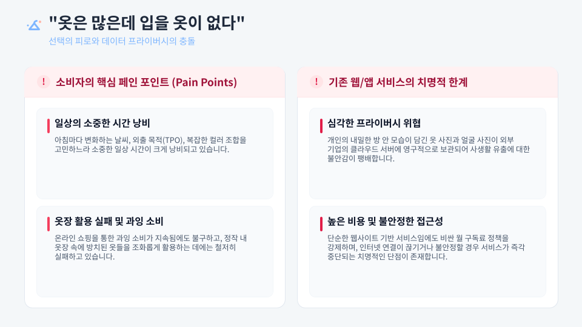<br /><br />
  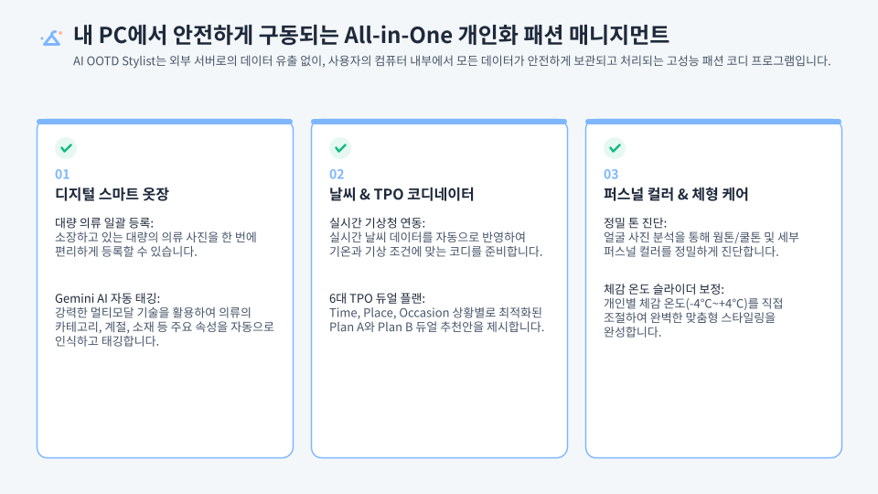<br /><br />
  <br /><br />
  <br /><br />
  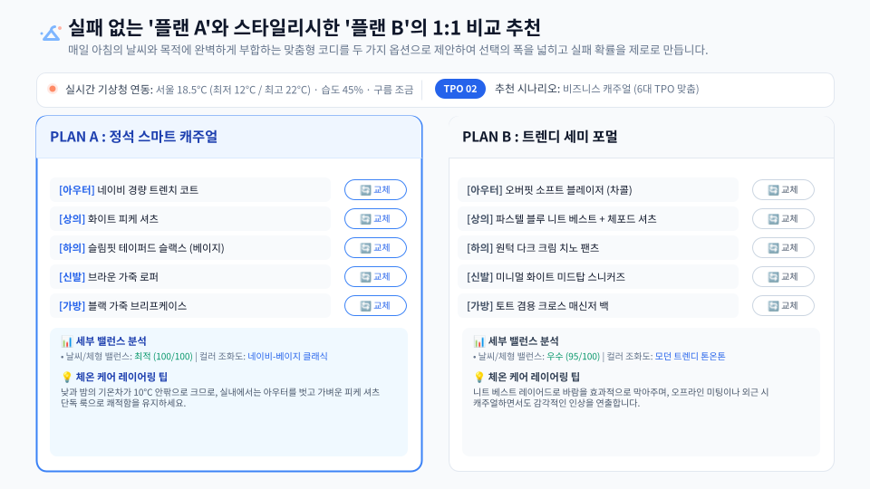<br /><br />
  <br /><br />
  <br /><br />
  <br /><br />
  <br /><br />
  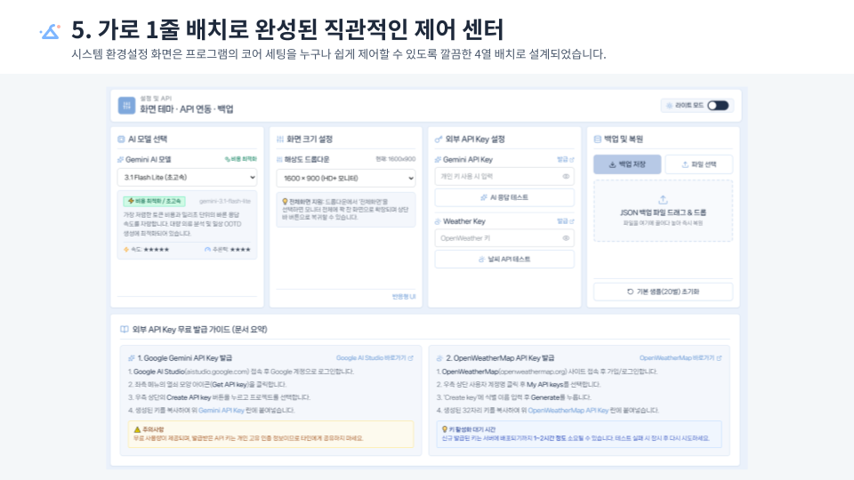<br /><br />
  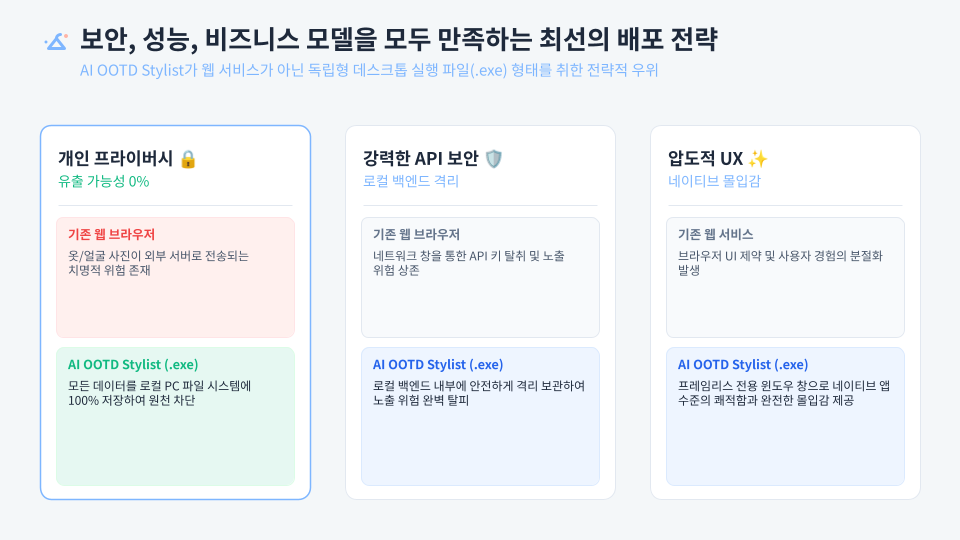<br /><br />
  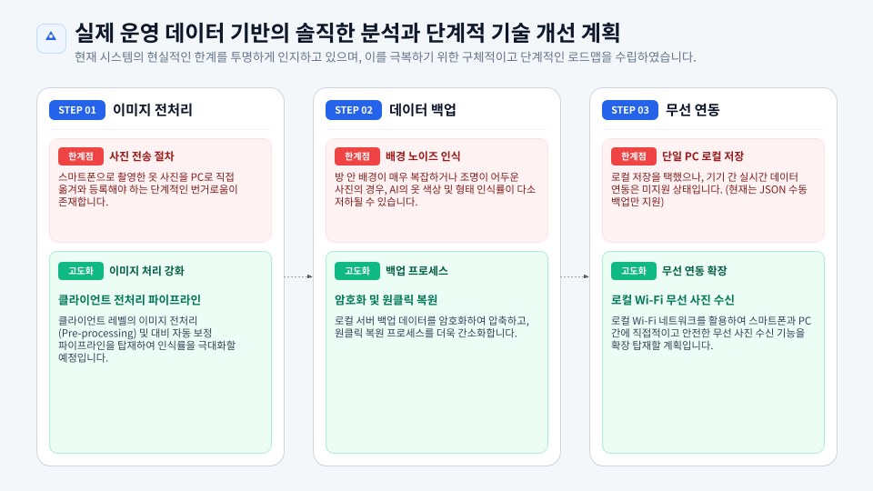<br /><br />
  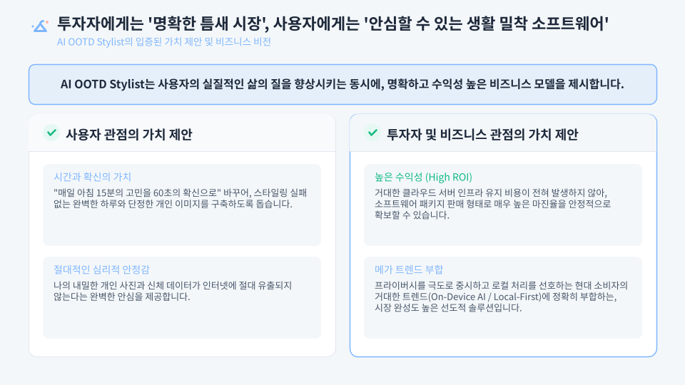
</p>

</details>

****

📈 개선사항 및 회고
-----------------------------------------------------------------------------------------------------------------------------------

### 개발 성과 및 배운 점
- **로컬 퍼스트(Local-First) 데이터 주권 확립:** 민감한 옷장 사진 및 개인 체형 정보가 외부 서버에 남지 않도록 로컬 파일 시스템 기반의 아키텍처를 설계하여 강력한 개인정보 보호를 달성했습니다.
- **사진 업로드 간편화:** QR코드 등을 이용해서 파일 전송 용의하도록 수정.

### 향후 목표,계획

1. **AI 기반 가상 착용(Virtual Try-On):** 추천된 코디 조합을 사용자 프로필 아바타에 직접 렌더링하는 2D/3D 가상 피팅 파이프라인 도입.
2. **옷장등록시 URL 활용:** 인터넷 스토어 구입시 URL 입력하는걸로 등록.
3. **지속 가능한 패션(Slow Fashion) 분석:** 옷장 내 자주 입지 않는 옷, 오래된 옷을 식별하여 리폼을 제안하거나 기부/중고 판매를 연계해주는 의류 순환 리포트 기능 추가.

****


👥 라이선스
-----------------------------------------------------------------------------------------------------------------------------------
본 프로젝트는 [MIT License](./LICENSE) 규정에 따라 자유롭게 사용 및 수정이 가능합니다.  
Copyright (c) 2026 Shin Jae Wan (AI OOTD Stylist). All rights reserved.
